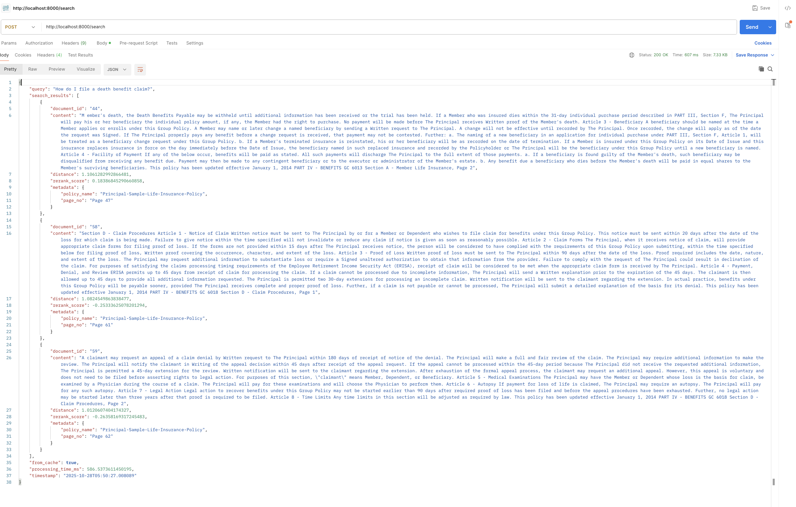
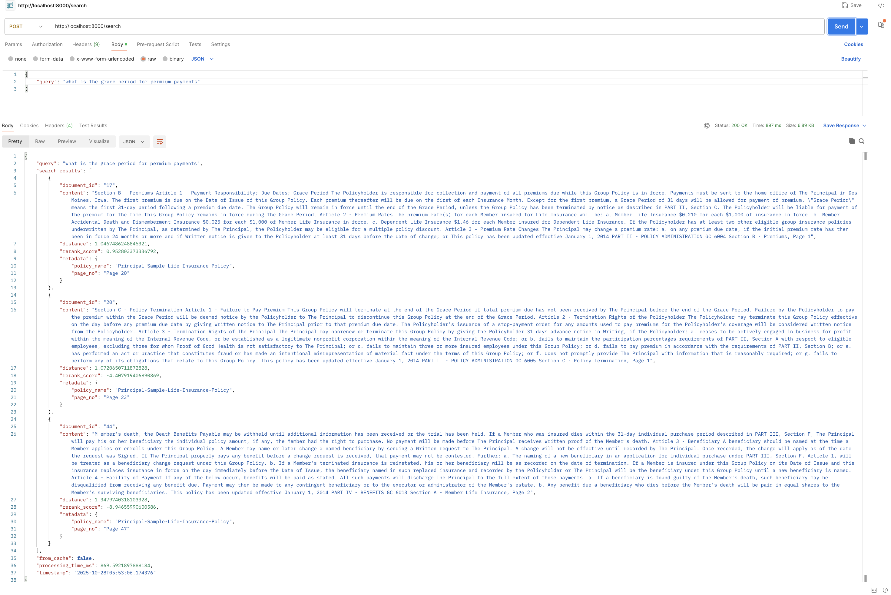
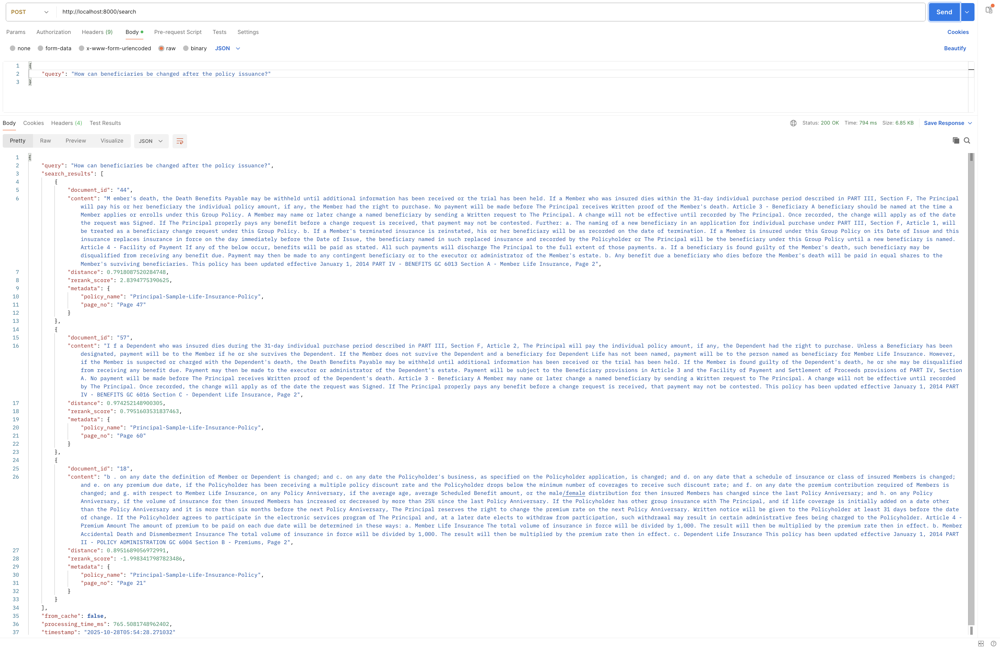
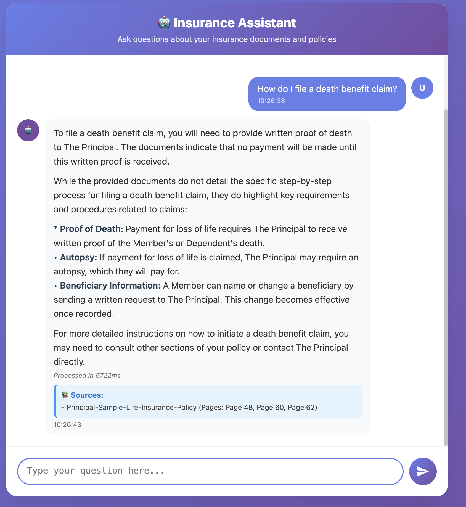
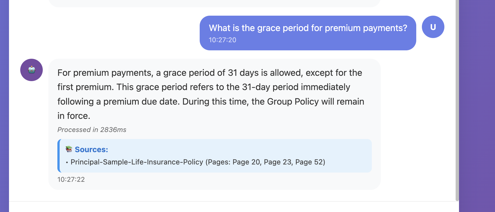
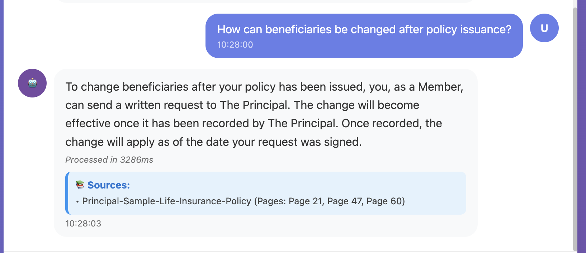

# HelpMateAI - RAG Pipeline API

A production-ready Retrieval-Augmented Generation (RAG) pipeline for insurance document querying, built with FastAPI and featuring a beautiful web chatbot interface.

## 🏗️ Architecture

The RAG pipeline is structured into three distinct layers:

### 1. **Embedding Layer** (Startup Script)
- **Purpose**: Document processing and vector store creation
- **Components**: PDF text extraction, document chunking, embedding generation
- **Implementation**: Runs as a startup script before the main application

### 2. **Search Layer** (Integrated)
- **Purpose**: Query processing and semantic search
- **Components**: Query embedding, ChromaDB search, cross-encoder re-ranking, caching
- **Features**: Cache-first search strategy for improved performance

### 3. **Generation Layer** (Integrated)
- **Purpose**: Response generation and formatting
- **Components**: LLM integration (Gemini), context preparation, citation extraction
- **Features**: Structured responses with proper citations

## 🚀 Quick Start

### Prerequisites
- Docker and Docker Compose
- At least 4GB RAM
- Internet connection for model downloads

### 1. Clone and Setup
```bash
git clone https://github.com/Jeeva0104/HelpMateAI.git
cd HelpMateAI
```

### 2. Environment Configuration
Update the `.env` file with your API credentials:
```bash
# API Configuration
API_KEY=your_api_key_here
BASE_URL=https://generativelanguage.googleapis.com/v1beta/openai/
MODEL=gemini-2.5-flash
```

### 3. Start the Application
```bash
docker-compose up --build
```

### 4. Verify Installation
Once running, check the health endpoint:
```bash
curl http://localhost:8000/health
```

### 5. Access the Web Interface
Open your browser and navigate to:
```
http://localhost:8000/chat
```

## 🌐 Web Chatbot Interface

HelpMateAI features a beautiful, modern web interface for interactive conversations with your insurance documents.

### Features:
- **Responsive Design**: Works seamlessly on desktop and mobile devices
- **Real-time Chat**: Interactive conversation with typing indicators
- **Smart Citations**: Automatic source referencing with page numbers
- **Modern UI**: Gradient design with smooth animations
- **Processing Info**: Real-time feedback on response times and caching
- **Markdown Support**: Rich text formatting for better readability

### Accessing the Interface:
1. Start the application using Docker Compose
2. Open your browser to `http://localhost:8000/chat`
3. Start asking questions about your insurance documents

## 📡 API Endpoints

### GET `/chat`
Access the interactive chatbot web interface.

**Usage:**
```
http://localhost:8000/chat
```

### POST `/query`
Submit queries to the RAG pipeline.

**Request:**
```json
{
  "query": "What are the requirements for proof of good health?",
  "include_metadata": true,
  "max_results": 10
}
```

**Response:**
```json
{
  "query": "What are the requirements for proof of good health?",
  "response": "Proof of Good Health is required in the following situations...",
  "citations": [
    {
      "policy_name": "Principal-Sample-Life-Insurance-Policy",
      "page_numbers": ["Page 9", "Page 49"]
    }
  ],
  "search_results": [...],
  "from_cache": false,
  "processing_time_ms": 1234.56,
  "timestamp": "2025-10-25T18:50:00"
}
```

### GET `/health`
Check system health and status.

**Response:**
```json
{
  "status": "Healthy",
  "timestamp": "2025-10-25T18:50:00",
  "vector_store_status": "Ready",
  "total_documents": 60,
  "uptime_seconds": 1800.5
}
```

### GET `/`
API information and available endpoints.

**Response:**
```json
{
  "message": "RAG Pipeline API",
  "version": "1.0.0",
  "description": "Retrieval-Augmented Generation Pipeline for Insurance Documents",
  "endpoints": {
    "query": "/query - POST - Submit queries to the RAG pipeline",
    "chat": "/chat - GET - Access the chatbot interface",
    "health": "/health - GET - Check system health",
    "docs": "/docs - GET - Interactive API documentation"
  }
}
```

### GET `/docs`
Interactive API documentation (Swagger UI).

## 🛠️ Usage Examples

### Web Interface (Recommended)
1. Open `http://localhost:8000/chat` in your browser
2. Type your question in the chat input
3. Receive formatted responses with citations
4. Continue the conversation naturally

### API - Basic Query
```bash
curl -X POST "http://localhost:8000/query" \
  -H "Content-Type: application/json" \
  -d '{
    "query": "What is the maximum benefit amount?",
    "include_metadata": true
  }'
```

### API - Query with Custom Parameters
```bash
curl -X POST "http://localhost:8000/query" \
  -H "Content-Type: application/json" \
  -d '{
    "query": "When is proof of good health required?",
    "include_metadata": false,
    "max_results": 5
  }'
```

### Python Example
```python
import requests

url = "http://localhost:8000/query"
payload = {
    "query": "What are the eligibility requirements?",
    "include_metadata": True
}

response = requests.post(url, json=payload)
result = response.json()

print(f"Query: {result['query']}")
print(f"Response: {result['response']}")
print(f"Citations: {result['citations']}")
```

## 🔍 RAG Pipeline in Action

Below are real examples demonstrating the two-stage RAG pipeline process: semantic search retrieval from the vector database and final formatted response generation.

### Stage 1: Search Results - Vector Database Retrieval

#### Example 1: Insurance Benefit Claims
**Query:** Insurance benefit and claims related query



*Shows the top 3 semantically similar document chunks retrieved from the vector database with similarity scores and relevance rankings.*

#### Example 2: Policy Terms and Conditions  
**Query:** Policy terms and conditions related query



*Demonstrates the vector search accuracy in finding relevant policy sections with high semantic similarity scores.*

#### Example 3: Premium and Payment Information
**Query:** Premium payment and financial terms query



*Illustrates the retrieval of contextually relevant financial and payment-related policy information.*

### Stage 2: Query Results - Final Formatted Responses

#### Example 1: Comprehensive Insurance Response
**Query:** Insurance-related inquiry with complete answer



*Shows the complete formatted response with proper citations, page references, and structured output from the generation layer.*

#### Example 2: Policy Information with Citations
**Query:** Policy details inquiry with source attribution



*Demonstrates the final response formatting with detailed citations and cross-references to specific policy sections.*

#### Example 3: Detailed Claims Process Response
**Query:** Claims and procedures inquiry with step-by-step guidance



*Presents the structured response format with comprehensive information and proper source documentation.*

### RAG Pipeline Benefits Demonstrated:
- **Accurate Retrieval**: Vector search finds semantically relevant content even with varied query phrasing
- **Contextual Understanding**: Cross-encoder re-ranking ensures the most relevant chunks are prioritized
- **Structured Responses**: LLM generation creates coherent, well-formatted answers with proper citations
- **Source Transparency**: Every response includes specific page references and document citations
- **Performance Optimization**: Caching and efficient search reduce response times for similar queries

## 🔧 Development

### Project Structure
```
HelpMateAI/
├── app/                          # Main application
│   ├── services/                 # Business logic services
│   │   ├── embedding_service.py  # Embedding & vector store
│   │   ├── search_service.py     # Search & re-ranking
│   │   └── generation_service.py # LLM response generation
│   ├── static/                   # Static files
│   │   └── chatbot.html         # Web chatbot interface
│   ├── utils/                    # Utility functions
│   │   ├── pdf_processor.py      # PDF text extraction
│   │   └── logger.py            # Logging configuration
│   ├── main.py                  # FastAPI application
│   ├── models.py                # Pydantic models
│   ├── config.py                # Configuration management
│   └── exceptions.py            # Custom exceptions
├── scripts/                     # Startup and utility scripts
│   └── build_vector_store.py    # Embedding layer startup script
├── data/                        # Input documents
│   └── Principal-Sample-Life-Insurance-Policy.pdf
├── screenshoot/                 # Example screenshots
│   ├── search-result-image1.png # Vector DB search results example 1
│   ├── search-result-image2.png # Vector DB search results example 2
│   ├── search-result-image3.png # Vector DB search results example 3
│   ├── query-result-image1.png  # Formatted response example 1
│   ├── query-result-image2.png  # Formatted response example 2
│   ├── query-result-image3.png  # Formatted response example 3
│   └── image4.png              # Legacy example image
├── chroma_db/                   # Vector database storage
├── logs/                        # Application logs
├── docker-compose.yml           # Docker orchestration
├── Dockerfile                   # Container definition
├── requirements.txt             # Python dependencies
├── .env.example                # Environment template
└── .gitignore                  # Git ignore rules
```

### Local Development
```bash
# Install dependencies
pip install -r requirements.txt

# Run startup script manually
python scripts/build_vector_store.py

# Start FastAPI with hot reload
uvicorn app.main:app --reload --host 0.0.0.0 --port 8000
```

### Adding New Documents
1. Place PDF files in the `data/` directory
2. Update the document processing logic in `app/utils/pdf_processor.py`
3. Restart the container to rebuild the vector store

### Configuration Options
Key configuration parameters in `.env`:

| Parameter | Description | Default |
|-----------|-------------|---------|
| `API_KEY` | Google Gemini API key | Required |
| `EMBEDDING_MODEL` | SentenceTransformer model | all-MiniLM-L6-v2 |
| `CROSS_ENCODER_MODEL` | Cross-encoder for re-ranking | cross-encoder/ms-marco-MiniLM-L-6-v2 |
| `SEARCH_RESULTS_LIMIT` | Max search results | 10 |
| `RERANK_TOP_K` | Top results after re-ranking | 3 |
| `CACHE_THRESHOLD` | Cache similarity threshold | 0.2 |

## 🐛 Troubleshooting

### Common Issues

**Vector Store Empty**
```bash
# Check if documents exist
docker exec -it helpmateai-rag-pipeline-1 ls /app/data

# Rebuild vector store
docker-compose down
docker-compose up --build
```

**Memory Issues**
```bash
# Increase Docker memory limit to 4GB+
# Check Docker Desktop settings
```

**API Key Issues**
```bash
# Verify environment variables
docker exec -it helpmateai-rag-pipeline-1 env | grep API_KEY
```

**Health Check Failures**
```bash
# Check application logs
docker-compose logs rag-pipeline

# Manual health check
docker exec -it helpmateai-rag-pipeline-1 python /app/scripts/build_vector_store.py health
```

**Web Interface Not Loading**
```bash
# Check if static files are mounted correctly
docker exec -it helpmateai-rag-pipeline-1 ls /app/app/static

# Verify port mapping
docker-compose ps
```

### Logs and Monitoring
```bash
# View real-time logs
docker-compose logs -f rag-pipeline

# Check container status
docker-compose ps

# Inspect vector store
curl http://localhost:8000/health
```

## 🔒 Security Considerations

- API keys are stored in environment variables
- No authentication implemented (add OAuth/JWT for production)
- CORS enabled for all origins (restrict for production)
- Input validation through Pydantic models
- Rate limiting not implemented (consider adding for production)
- XSS protection implemented in web interface

## 📊 Performance

- **Cold start**: ~30-60 seconds (model loading)
- **Query time**: ~1-3 seconds (depending on cache)
- **Cache hit**: ~500ms
- **Memory usage**: ~2-4GB (models + embeddings)
- **Storage**: ~100MB per 1000 document pages
- **Web interface**: Optimized for real-time interactions

## 🚦 Production Deployment

### Environment Variables for Production
```bash
# Update .env for production
ENV=production
LOG_LEVEL=WARNING
API_HOST=0.0.0.0
API_PORT=8000

# Add authentication
AUTH_ENABLED=true
JWT_SECRET_KEY=your_secret_key

# Database settings
CHROMA_DB_PATH=/data/chroma_db
```

### Docker Production Build
```bash
# Build production image
docker build -t helpmateai:prod .

# Run with production settings
docker run -d \
  --name helpmateai-prod \
  -p 8000:8000 \
  -v /host/data:/app/data \
  -v /host/chroma_db:/app/chroma_db \
  --env-file .env.production \
  helpmateai:prod
```

### Production Considerations
- Implement proper authentication and authorization
- Set up reverse proxy (nginx) for SSL termination
- Configure rate limiting and request throttling
- Set up monitoring and alerting
- Implement backup strategies for vector database
- Use production-grade secret management

## 📄 License

This project is licensed under the MIT License - see the LICENSE file for details.

## 🤝 Contributing

1. Fork the repository
2. Create a feature branch (`git checkout -b feature/amazing-feature`)
3. Make your changes
4. Add tests if applicable
5. Commit your changes (`git commit -m 'Add amazing feature'`)
6. Push to the branch (`git push origin feature/amazing-feature`)
7. Submit a pull request

## 📞 Support

For issues and questions:
- Check the troubleshooting section above
- Review application logs using `docker-compose logs`
- Open an issue on [GitHub](https://github.com/Jeeva0104/HelpMateAI/issues)
- Use the web interface at `/chat` for testing queries

## 🔗 Related Links

- [FastAPI Documentation](https://fastapi.tiangolo.com/)
- [ChromaDB Documentation](https://docs.trychroma.com/)
- [Sentence Transformers](https://www.sbert.net/)
- [Google Gemini API](https://ai.google.dev/)
